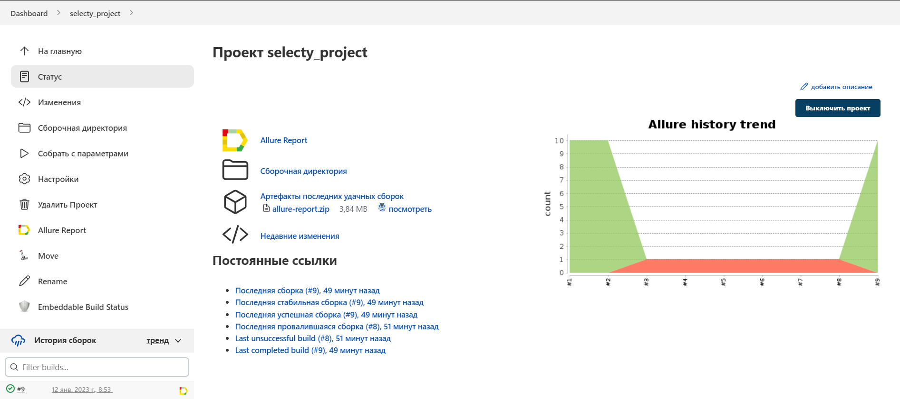
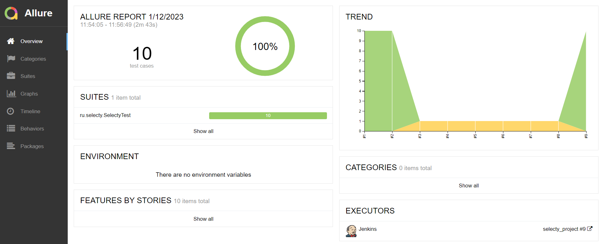
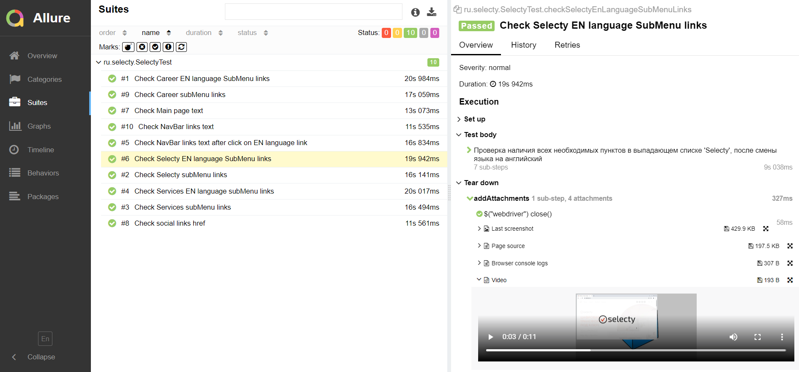
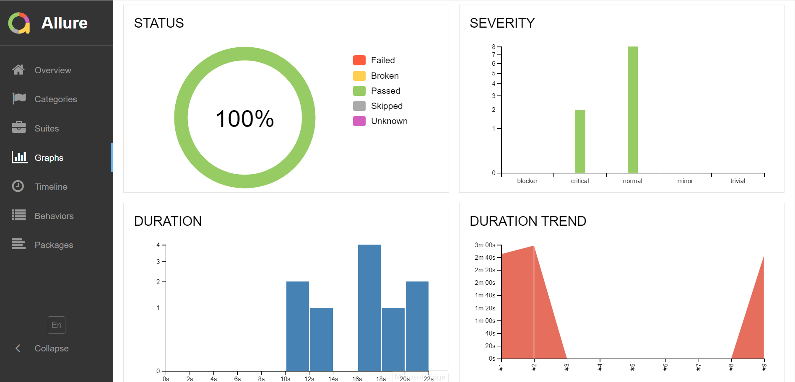
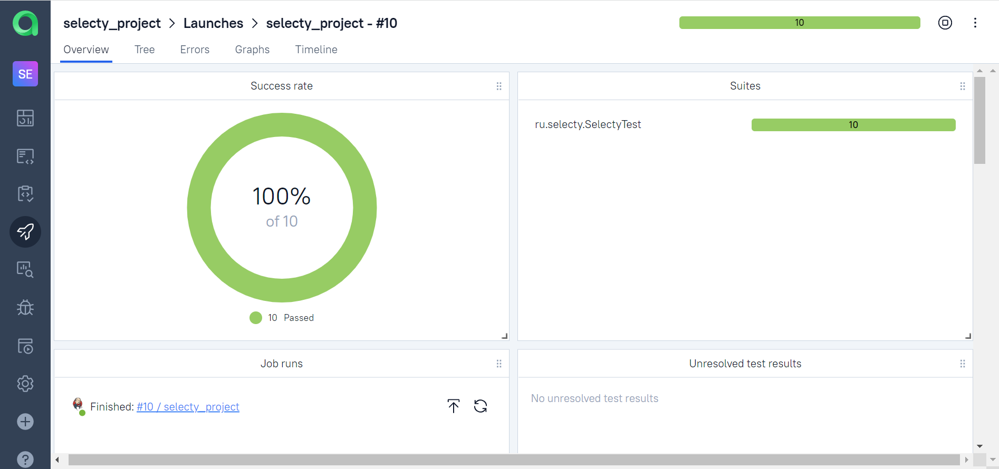
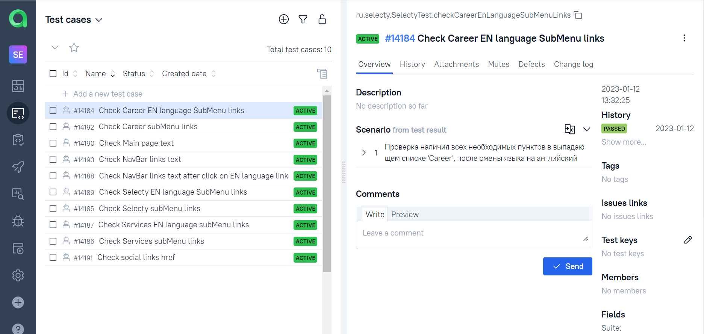
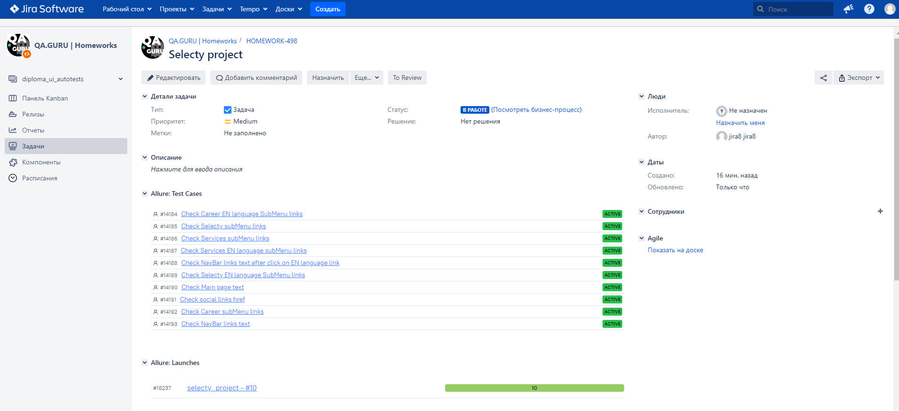
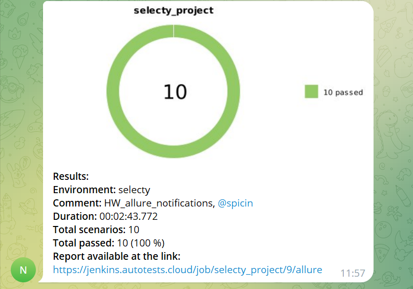

<h1>Проект по автоматизации тестирования для Selecty</h1>

<div style="display: flex; flex-direction:column;">
<a target="_blank" href="https://www.selecty.ru/"></a>
</div>

## :pushpin: Содержание:

<ul>
<li>Технологии и инструменты</li>
<li>Реализованные проверки</li>
<li>Сборка в Jenkins</li>
<li>Запуск из терминала</li>
<li>Allure отчет</li>
<li>Интеграция с Allure TestOps</li>
<li>Интеграция с Jira</li>
<li>Отчет в Telegram</li>
<li>Видео примеры прохождения тестов</li>
</ul>

## :rocket: Технологии и инструменты

<div align="center">
<a href="https://www.jetbrains.com/idea/"></a>
<a href="https://www.java.com/"></a>
<a href="https://github.com/"></a>
<a href="https://junit.org/junit5/"></a>
<a href="https://gradle.org/"></a>
<a href="https://selenide.org/"></a>
<a href="https://aerokube.com/selenoid/"></a>
<a href="https://github.com/allure-framework/allure2"></a>
<a href="https://www.jenkins.io/"></a>
</div>

## :scroll: Реализованные проверки

- ✓ Проверка текста на главной странице.
- ✓ Проверка наличия необходимых ссылок в нав баре".
- ✓ Проверка наличия необходимых ссылок в нав баре, после смены языка на английский".
- ✓ Проверка наличия всех необходимых пунктов в выпадающем списке 'Selecty".
- ✓ Проверка наличия всех необходимых пунктов в выпадающем списке 'Услуги'.
- ✓ Проверка наличия всех необходимых пунктов в выпадающем списке 'Карьера'.
- ✓ Проверка наличия всех необходимых пунктов в выпадающем списке 'Selecty', после смены языка на английский.
- ✓ Проверка наличия всех необходимых пунктов в выпадающем списке 'Services', после смены языка на английский.
- ✓ Проверка наличия всех необходимых пунктов в выпадающем списке 'Career', после смены языка на английский.
- ✓ Проверка наличия всех необходимых ссылок на социальные сети компании.

##  Jenkins job

<a target="_blank" href="https://jenkins.autotests.cloud/job/selecty_project/">Сборка в Jenkins</a>
<div align="center">
<a href="https://jenkins.autotests.cloud/job/selecty_project/"></a>
</div>

### Параметры сборки в Jenkins:

- browser (браузер, по умолчанию chrome)
- browserVersion (версия браузера, по умолчанию 100.0)
- browserSize (размер окна браузера, по умолчанию 1920x1080)
- baseUrl (https://selecty.ru/)
- remoteDriverUrl (selenoid.autotests.cloud)
- timeout (4000)
- env (remote)
- selenoidUrl (https://${LOGIN}:${PASSWORD}@${REMOTE_DRIVER_URL})
- login
- password

## :computer: Запуск тестов из терминала

Локальный запуск:

```bash
gradle clean test -Denv=local
```

Удаленный запуск:

```bash
clean
test
"-Denv=${ENV}"
"-Dlogin=${LOGIN}"
"-Dpassword=${PASSWORD}"
"-DremoteDriverUrl=${REMOTE_DRIVER_URL}"
"-DbrowserSize=${BROWSER_SIZE}"
"-DbrowserVersion=${BROWSER_VERSION}"
"-Dbrowser=${BROWSER}"
"-DremoteUrl=${SELENOID_URL}"
"-DbaseUrl=${BASE_URL}"
```

##  Отчет в <a target="_blank" href="https://jenkins.autotests.cloud/job/selecty_project/9/allure/">Allure report</a>

### Основное окно

<div align="center">

</div>

### Тесты

<div align="center">

</div>

### Графики

<div align="center">

</div>

## </a>Интеграция с <a target="_blank" href="https://allure.autotests.cloud/launch/18237">Allure TestOps</a>

### Дашборд

<div align="center">

</div>

### Тест-кейсы

<div align="center">

</div>

## </a>Интеграция с трекером задач <a target="_blank" href="https://jira.autotests.cloud/browse/HOMEWORK-498">Jira</a>

<div align="center">

</div>

## </a> Уведомление в Telegram при помощи бота

<div align="center">

</div>

### </a> Примеры видео о прохождении тестов

<div align="center">
<video src="https://user-images.githubusercontent.com/59203915/212070784-8b04f9f5-3d3d-4d86-90bb-f958c8455fc4.mp4"></video>
<video src="https://user-images.githubusercontent.com/59203915/212070789-7ac73637-9758-47e6-9819-626f311a50d6.mp4"></video>
</div>
